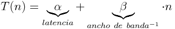
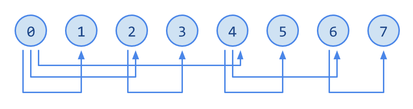
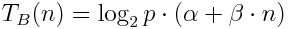
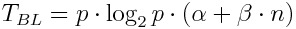
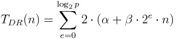

# Cálculos teóricos

### Tiempo de difusión de un mensaje de longitud _n_

## Broadcast de MPI

Tiempo de difusión teórico usando el broadcast de MPI:

<!---
T_B(n)=\log_2{p}\cdot(\alpha+\beta\cdot n)
-->

## Difusión por broadcast lineal

Cada proceso ha de hacer un broadcast. Por lo tanto el tiempo total de la difusión es:

<!---
T_{BL}(n)=p\cdot \log_2{p}\cdot(\alpha+\beta\cdot n)
-->

## Difusión por doblado recursivo

En cada etapa hay _n_ envíos de tamaño exponencialmente proporcional al número de etapa, y el número de etapas es logarítmico.

<!---
T_{DR}(n)=\sum_{e=0}^{\log_2{p}}2\cdot(\alpha+\beta\cdot 2^e\cdot n)

        log {p}             
          _2                   e
T  (n) = \    2 (alpha + beta 2 n)
 DR      /__
        e = 0
-->