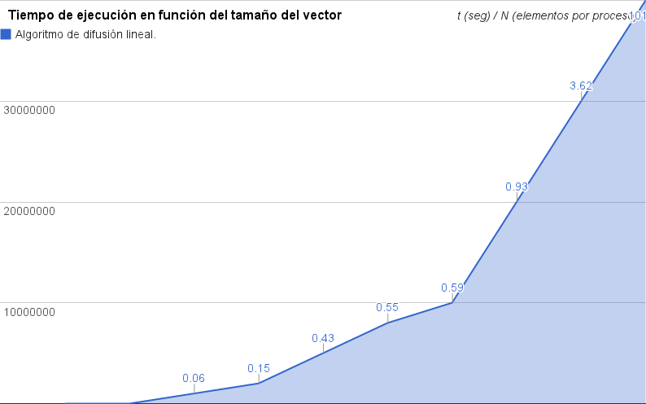
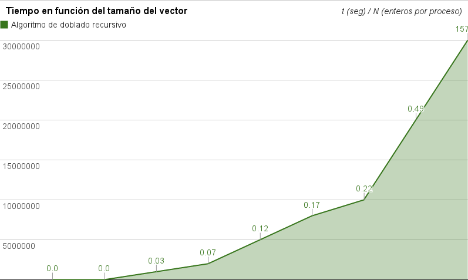
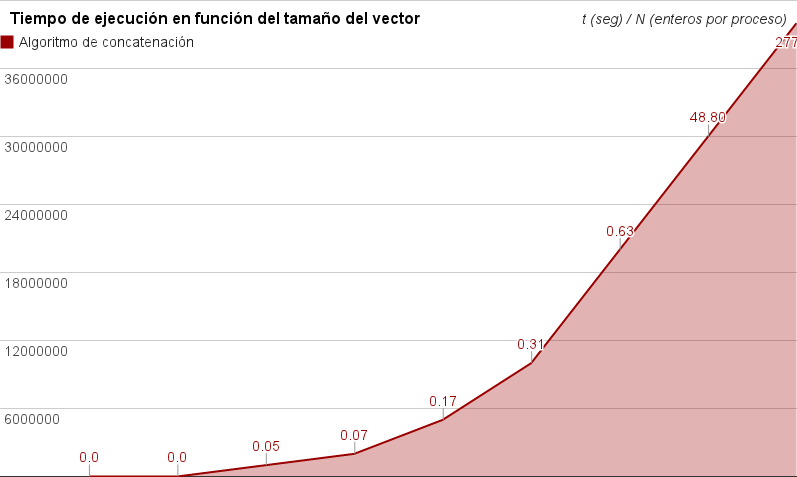
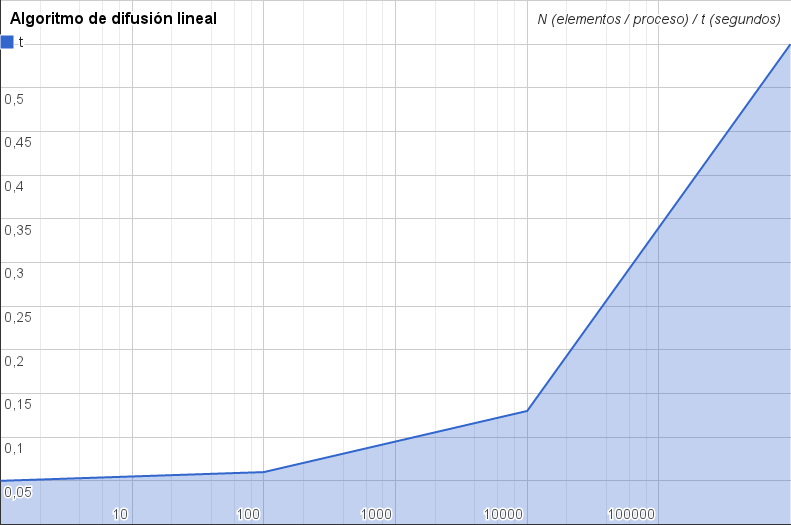
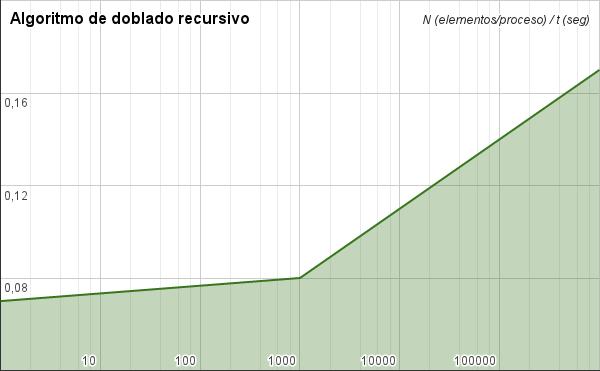
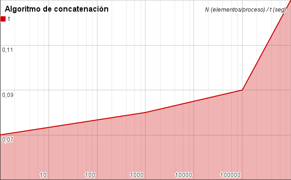

# Gráficas de Rendimiento
=======================

Medidas en segundos de 4 procesos AMD Phenom II 965@3.40 GHz x4 OC 3.6GHz 4GB RAM ddr2 800 MHZ

## Práctica L2.1

### Difusión lineal

## Práctica L2.2

### Doblado recursivo

## Práctica L3

### Concatenación

Medidas en segundos de 8 procesos Intel i7@2.20 GHz x8 8GB RAM ddr3 1600 MHZ

## Práctica L2.1

### Difusión lineal

## Práctica L2.2

### Doblado recursivo

## Práctica L3

### Concatenación

